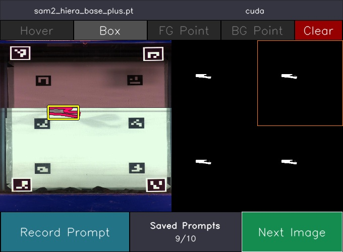

# Sam2 label

This repository is based on [muggled sam](https://github.com/heyoeyo/muggled_sam) and let's you create accurate segmentation masks with SAM2.
 
<p align="center">
  
</p>

## Getting started

This section contains the steps that need to be taken to get started with this project and to label 
your own dataset. This project was developed on Windows 11 os on Python 3.12 and AlmaLinux 8 on Python 3.11


### 1. Clone the repository

Make sure to clone the repository with your favourite git client or using the following command:

```
https://github.com/Gregoire-Andre-Dumont/SAM2-label.git
```

### 2. Install the required packages

Install the required packages (on a virtual environment is recommended) using the following command:

```shell
pip install -r requirements.txt
```

### 3. Model weights

You'll need to download the weights for SAM 2. There are four officially supported models: tiny, small, base-plus, and large. This project uses the exact same weights as the original implementations, which can be downloaded from the Model Description section of this [repository](https://github.com/facebookresearch/sam2?tab=readme-ov-file#model-description). Note that only the checkpoint files are required. After downloading a model file, you can place it in the tm folder of this repository. You can also keep track of the file path, as you will need to provide it when running `label.py`

## Run create_reference

`label.py` allows you to create accurate segmentation masks with a user-interface. The script reads a configuration file `conf/label.yaml`, which specifies the model and image paths. Once loaded, a window will appear with options for how to prompt the image (e.g. bounding boxes or clicking to add points). The interface will show four potential masks based on your prompts. You can then either your prompts or select one of the masks. Once finalized, the interface saves the mask and moves on to the next image. For additional details [video with image priors](https://github.com/heyoeyo/muggled_sam/tree/main/experiments).
